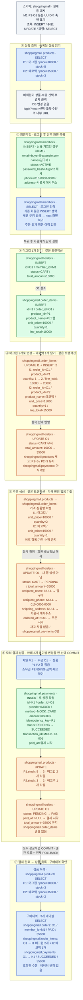

# 상품 구매 시뮬레이션 — 테이블 행의 변화

모든 테이블은 `shoppingmall` 스키마입니다. 표시하지 않은 컬럼은 기본값 또는 기존 값을 유지합니다. 비회원 장바구니 저장·병합은 생략하는 가정입니다.

```mermaid
flowchart TB
    NOTE["스키마: shoppingmall · 설계용 예시<br/>M1·P1·O1 등은 UUID의 축약 표기<br/>초록: INSERT / 주황: UPDATE / 파랑: SELECT"]:::note

    subgraph S0["① 상품 조회 · 등록된 상품 읽기"]
        direction LR
        P0["shoppingmall.products · SELECT<br/>P1: 머그컵 / price=10000 / stock=5<br/>P2: 에코백 / price=15000 / stock=3"]:::read
        G0["비회원이 상품·수량 선택 후 결제 클릭<br/>DB 변경 없음<br/>login?next=선택 상품·수량의 내부 URL"]:::note
        P0 --> G0
    end

    subgraph S1["② 회원가입 · 로그인 후 선택 화면 복귀"]
        direction LR
        M1["shoppingmall.members · INSERT · 신규 가입인 경우<br/>id=M1 / email=buyer@example.com<br/>name=김구매 / status=ACTIVE<br/>password_hash=Argon2 해시<br/>phone=010-0000-0000 / address=서울시 예시주소"]:::insert
        L1["shoppingmall.members · SELECT · 로그인 검증<br/>기존 회원은 INSERT 생략<br/>세션 쿠키 발급 → next 화면 복귀<br/>주문·결제 행은 아직 없음"]:::read
        M1 --> L1
    end

    subgraph S2["③ 머그컵 1개 담기 · 같은 트랜잭션"]
        direction LR
        O2["shoppingmall.orders · INSERT<br/>id=O1 / member_id=M1<br/>status=CART / total_amount=10000"]:::insert
        I2["shoppingmall.order_items · INSERT<br/>id=I1 / order_id=O1 / product_id=P1<br/>product_name=머그컵<br/>unit_price=10000 / quantity=1<br/>line_total=10000"]:::insert
        O2 -->|"O1 참조"| I2
    end

    subgraph S3["④ 머그컵 2개로 변경 + 에코백 1개 담기 · 같은 트랜잭션"]
        direction LR
        I3["shoppingmall.order_items · UPDATE I1 + INSERT I2<br/>I1: order_id=O1 / product_id=P1<br/>quantity: 1 → 2 / line_total: 10000 → 20000<br/>I2: order_id=O1 / product_id=P2<br/>product_name=에코백 / unit_price=15000<br/>quantity=1 / line_total=15000"]:::update
        O3["shoppingmall.orders · UPDATE O1<br/>status=CART 유지<br/>total_amount: 10000 → 35000<br/>shoppingmall.products 재고: P1=5 / P2=3 유지<br/>shoppingmall.payments: 아직 0행"]:::update
        I3 -->|"항목 합계 반영"| O3
    end

    subgraph S4["⑤ 주문 생성 · 같은 트랜잭션 · 가격 변경 없음 가정"]
        direction LR
        I4["shoppingmall.products → shoppingmall.order_items · 가격·상품명 확정<br/>I1: 머그컵 / unit_price=10000 / quantity=2<br/>I2: 에코백 / unit_price=15000 / quantity=1<br/>이후 항목·가격 수정 금지"]:::update
        O4["shoppingmall.orders · UPDATE O1 · 새 행 생성 아님<br/>status: CART → PENDING / total_amount=35000<br/>recipient_name: NULL → 김구매<br/>recipient_phone: NULL → 010-0000-0000<br/>shipping_address: NULL → 서울시 예시주소<br/>ordered_at: NULL → 주문 시각<br/>재고 차감 없음 / shoppingmall.payments 0행"]:::update
        I4 -->|"합계 확정 · 회원 배송정보 복사"| O4
    end

    subgraph S5["⑥ 모의 결제 성공 · 아래 3개 테이블 변경을 한 번에 COMMIT"]
        direction LR
        LOCK["회원 M1 → 주문 O1 → 상품 P1·P2 행 잠금<br/>소유권·PENDING·금액·재고 확인"]:::read
        K5["shoppingmall.payments · INSERT 후 성공 확정<br/>id=K1 / order_id=O1<br/>provider=MOCK / method=MOCK_CARD<br/>amount=35000 / idempotency_key=R1<br/>status: PENDING → SUCCEEDED<br/>transaction_id=MOCK-TX-001<br/>paid_at=결제 시각"]:::insert
        P5["shoppingmall.products · UPDATE<br/>P1.stock: 5 → 3 · 머그컵 2개 차감<br/>P2.stock: 3 → 2 · 에코백 1개 차감"]:::update
        O5["shoppingmall.orders · UPDATE O1<br/>status: PENDING → PAID<br/>paid_at: NULL → 결제 시각<br/>total_amount=35000 유지<br/>shoppingmall.order_items 변경 없음"]:::update
        LOCK --> K5 --> P5 --> O5
    end

    subgraph S6["⑦ 결제 완료 → 상품 목록 · 구매내역 확인"]
        direction LR
        V6["상품 목록 · shoppingmall.products SELECT<br/>P1: 머그컵 / price=10000 / stock=3<br/>P2: 에코백 / price=15000 / stock=2"]:::read
        H6["구매내역 · 3개 테이블 SELECT<br/>shoppingmall.orders: O1 / member_id=M1 / PAID / 35000<br/>shoppingmall.order_items: O1 → I1 머그컵 2개 + I2 에코백 1개<br/>shoppingmall.payments: O1 → K1 / SUCCEEDED / 35000<br/>조회만 수행 · 데이터 변경 없음"]:::read
        V6 --> H6
    end

    NOTE --> P0
    G0 --> M1
    L1 -->|"복귀 후 사용자가 담기 실행"| O2
    I2 --> I3
    O3 --> I4
    O4 --> LOCK
    O5 -->|"모두 성공하면 COMMIT · 중간 오류는 전체 ROLLBACK"| V6

    classDef insert fill:#dcfce7,stroke:#15803d,color:#14532d
    classDef update fill:#ffedd5,stroke:#c2410c,color:#7c2d12
    classDef read fill:#dbeafe,stroke:#1d4ed8,color:#1e3a8a
    classDef note fill:#f1f5f9,stroke:#64748b,color:#0f172a
```

